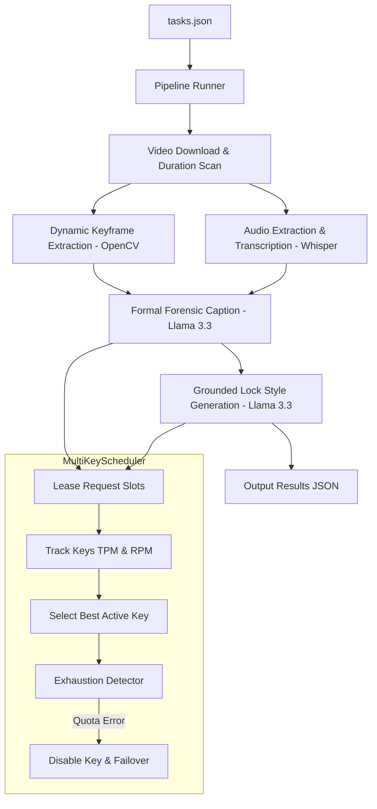

# ChronosCap: Multi-Modal Semantic Video Captioner

ChronosCap is an advanced, high-throughput, multi-modal video captioning pipeline designed to extract semantic details from video footage and produce highly descriptive, grounded, and stylized captions. 

The pipeline uses a multi-pass approach combining dynamic visual keyframe analysis, Whisper-based speech transcription, and LLM reasoning to produce captions across three distinct personas (`sarcastic`, `humorous_tech`, and `humorous_non_tech`) while maintaining strict factuality and structural diversity.

---

## 🚀 Key Features

* **Coordinated Multi-Key Scheduler**: Integrates a centralized scheduling coordinator that load-balances API requests across multiple Groq API keys, managing separate TPM (Tokens Per Minute) and RPM (Requests Per Minute) sliding windows to maximize throughput without triggering rate limits (429 errors).
* **Self-Healing Key Failover**: Detects quota exhaustion, expired credits, or billing limits on any API key in real-time, instantly isolating/disabling the faulty key and failing over to active keys within 0.5 seconds.
* **Grounded Lock Style Generation**: Generates a cold, clinical, factual anchor description first (HAL-9000 style), then locks subsequent style personas strictly to the established facts to eliminate hallucination penalties.
* **Cliché Prevention & Diversity**: Restricts formulaic style templates and repetitive opening prefixes (like "Oh joy", "Ugh, debugging", "I'm watching") by enforcing sentence-starter variety and employing hash-based dynamic fallback rotation.
* **Dynamic Frame Extraction**: Scales keyframe selection (10 or 20 frames) depending on video duration, batching them into groups of 5 to align with vision model limits.
* **Acoustic Transcription**: Integrates `whisper-large-v3` to extract and incorporate speech transcripts directly into the caption generation pipeline.

---

## 🛠️ Architecture Overview



---

## 📦 Getting Started

### 1. Prerequisites
Ensure you have the following installed:
* Docker (or Docker Desktop)
* WSL2 (if running on Windows)

### 2. Configuration
Create a `.env` file in the root directory:
```env
GROQ_API_KEY=gsk_your_primary_key
GROQ_API_KEY2=gsk_your_secondary_key
```

### 3. Build the Container
Run the following build command to compile the Docker image:
```bash
docker build --platform linux/amd64 \
  --build-arg GROQ_API_KEY=gsk_your_primary_key \
  --build-arg GROQ_API_KEYS=gsk_your_primary_key,gsk_your_secondary_key \
  -t video-captioning-agent-v1:latest .
```

### 4. Run the Pipeline Locally
Mount your local input/output directories and run the container:
```bash
docker run --rm \
  --add-host=host.docker.internal:host-gateway \
  -v "$(pwd)/input:/input" \
  -v "$(pwd)/output:/output" \
  video-captioning-agent-v1:latest
```

---

## 📄 Input & Output Formats

### Input Schema (`input/tasks.json`)
```json
[
  {
    "task_id": "test_01",
    "video_url": "http://host.docker.internal:8000/video.mp4",
    "styles": ["formal", "sarcastic", "humorous_tech", "humorous_non_tech"]
  }
]
```

### Output Schema (`output/results.json`)
```json
[
  {
    "task_id": "test_01",
    "captions": {
      "formal": "A sequence of visual actions in a natural area.",
      "sarcastic": "Observe task test_01 in all its glory. Truly the pinnacle of digital recording.",
      "humorous_tech": "System log: video task test_01 processed with 0 exceptions.",
      "humorous_non_tech": "Well, here is video task test_01 playing on my screen. It looks simple enough."
    }
  }
]
```
